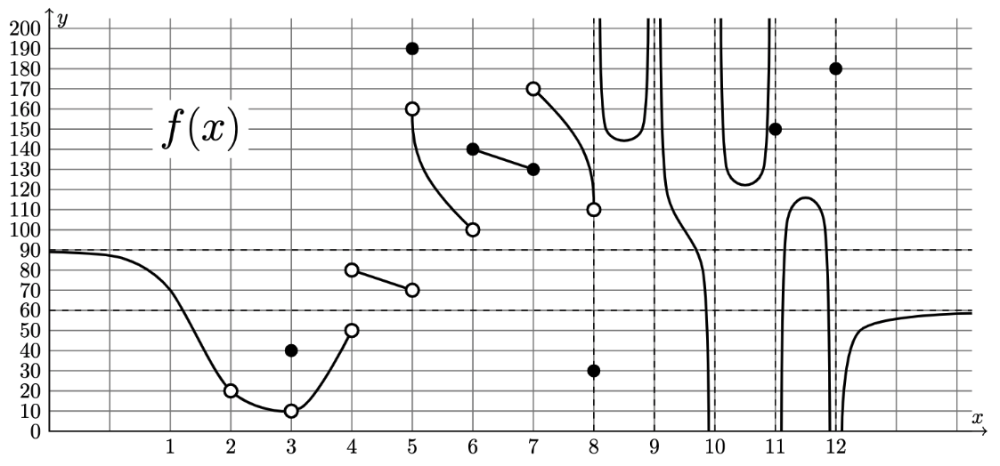
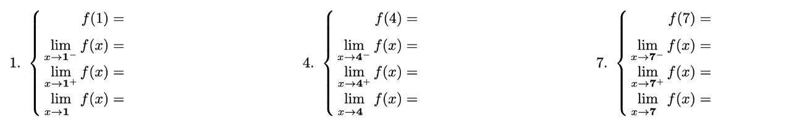

# Math Teaching Handouts and Worksheets (LaTeX)

## 1. Plickers ([Plickers.com](http://www.plickers.com))... but with tabs for quick lookup (plickers2.[tex](plickers2.tex) [pdf](plickers2.pdf))

## 2. Calculus Worksheet: Limits (calc33-limits.[tex](calc33-limits.tex) [pdf](calc33-limits.pdf))

